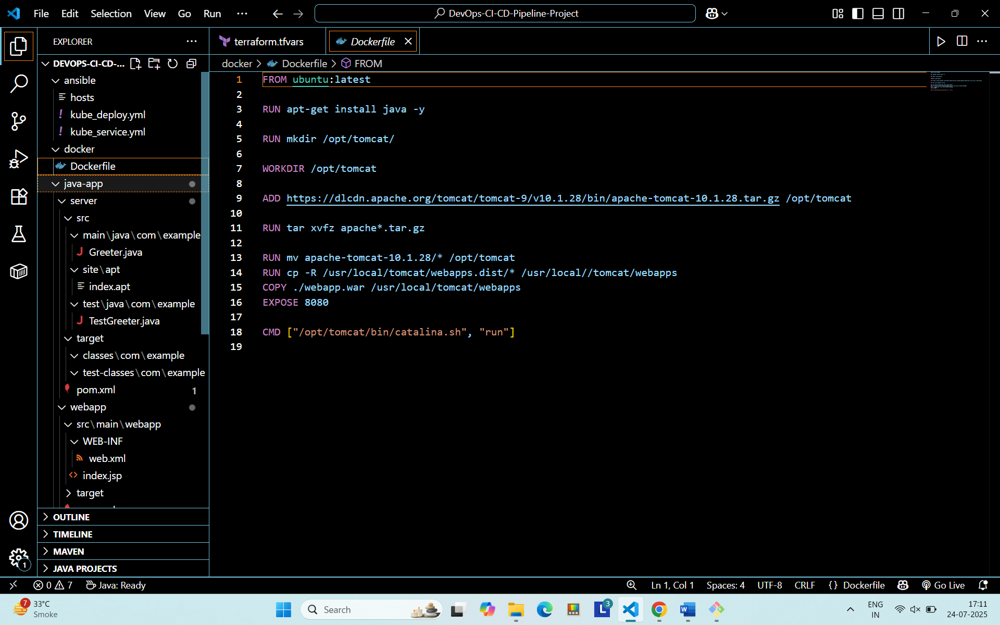
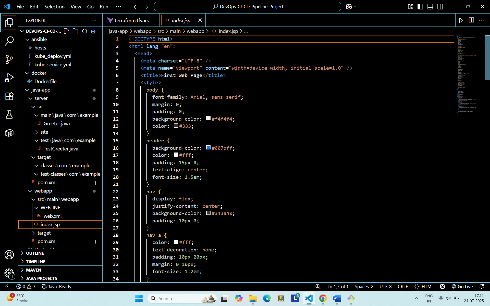
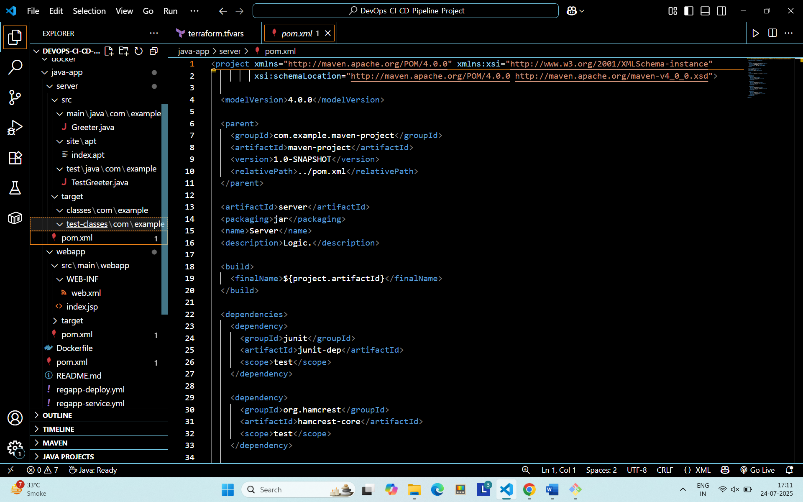

# DevOps CI/CD Pipeline Project

## Project Overview

This project demonstrates a complete CI/CD pipeline setup for a simple Java application using Git, 
Jenkins, Maven, Tomcat, Docker, Ansible, Terraform, and Azure Kubernetes Service (AKS). The project is divided into two sections:

1. **CI/CD Pipeline Using Git, Jenkins, Maven, Docker, and Ansible**
2. **CI/CD Pipeline with Kubernetes Using Azure AKS, Jenkins, Terraform, and Ansible**

## Project Architecture

The project uses multiple virtual machines on Azure for the CI/CD setup:
- **VM 1:** Jenkins Server (provisioned with Terraform)
- **VM 2:** Docker Host
- **VM 3:** Ansible Host

Additionally, the project uses Azure AKS for Kubernetes deployments (provisioned with Terraform).

---

### 🛠️ CI/CD Pipeline Setup Screenshot

### 💻 HTML Page View

### ⚙️ XML Config Example

### 🔢 Java Code Snippet

## Section 1: CI/CD Pipeline Using Git, Jenkins, Maven, Docker, and Ansible

### Steps Involved

1. **Jenkins Setup:**
    - Install and configure Jenkins on the first VM.
    - Integrate Jenkins with GitHub to pull the Java project code automatically using Poll SCM.
    - Integrate Maven with Jenkins to automate the build process.

2. **Tomcat and Docker Integration:**
    - Create a Tomcat container using Docker.
    - Customize the Dockerfile to include the Java application deployment on Tomcat.
    - Integrate Docker with Jenkins to automate the build and deployment of the Docker container.

3. **Automated Build and Deployment:**
    - Configure Jenkins jobs to build the Java application, create a Docker image, and deploy it to a Docker container on the Docker VM.
    - Use Ansible playbooks to automate the continuous deployment of the Docker container across environments.

### Pipeline Flow

1. Jenkins pulls the code from the GitHub repository.
2. Maven builds the project and generates the JAR file.
3. Docker builds the Tomcat container using a customized Dockerfile.
4. Jenkins deploys the Docker container with the Java application.
5. Ansible playbooks manage the automated deployments and updates across environments.

---

## Section 2: CI/CD Pipeline with Kubernetes Using Azure AKS, Jenkins, Terraform, and Ansible

### Steps Involved

1. **Terraform for Infrastructure Provisioning:**
    - Use Terraform to provision the following resources in Azure:
        - Jenkins VM for CI/CD management.
        - AKS cluster for Kubernetes deployments.

2. **Azure Kubernetes Service (AKS) Setup:**
    - Configure the AKS cluster to host Kubernetes resources (pods, services).
    - Create deployment and service YAML files to define Kubernetes resources.

3. **Kubernetes and Ansible Integration:**
    - Integrate Kubernetes with Ansible for automated deployment and management of resources.
    - Use Ansible playbooks to apply deployment and service configurations on AKS.

4. **Jenkins Deployment Job for Kubernetes:**
    - Create a Jenkins job to deploy the application on Kubernetes using the latest Docker image.
    - Enable rolling updates to deploy the latest changes seamlessly.

5. **Complete CI/CD Pipeline:**
    - Jenkins automates the entire process: building the code, creating the Docker image, deploying on Kubernetes, and managing rolling updates.

### Pipeline Flow

1. Terraform provisions the Jenkins VM and AKS cluster in Azure.
2. Jenkins builds the Java application and creates a Docker image.
3. The Docker image is pushed to a container registry.
4. Jenkins triggers the Ansible playbooks to apply Kubernetes deployments and services.
5. Kubernetes manages the pods and services, ensuring high availability and scalability.

---

## Project Features

- **Infrastructure as Code:** Terraform scripts for provisioning Azure resources.
- **Continuous Integration:** Automated builds with Maven and Jenkins.
- **Continuous Deployment:** Deployment automation using Docker and Kubernetes.
- **Rolling Updates:** Seamless updates to the application without downtime.
- **Infrastructure as Code:** Ansible playbooks for automated deployments.
- **Scalability:** Kubernetes integration for horizontal scaling.

---

## Technologies Used

- **Version Control:** Git, GitHub
- **CI/CD Tools:** Jenkins, Maven
- **Containerization:** Docker, Docker Hub
- **Orchestration:** Kubernetes (AKS)
- **Configuration Management:** Ansible
- **Infrastructure as Code:** Terraform
- **Web Server:** Apache Tomcat
- **Cloud Provider:** Microsoft Azure

---
---

## Future Improvements

- Implement monitoring and logging for the CI/CD pipeline using Prometheus and Grafana.
- Explore multi-cloud deployment strategies using AWS and Google Cloud in addition to Azure.
- Enhance Kubernetes deployment by creating and managing Helm Charts for easier version control, upgrades, and rollbacks.

---

## Conclusion

This project demonstrates a comprehensive CI/CD pipeline setup using various DevOps tools and practices, from code integration and containerization to automated deployments and orchestration in a Kubernetes environment.
---
